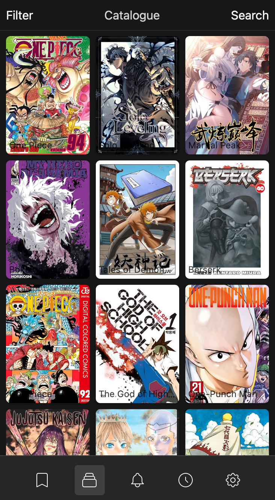

#  Tanoshi
Selfhosted web manga reader with extension model.

### Mobile


### Desktop


## Features
### Currently working
- Browse, search, and read manga from local, mangadex and [more](https://github.com/fadhlika/tanoshi-extensions)
- Favorite mangas
- Reading history across devices
- See chapter updates
- Read in single page, double page, or long strip
- Read from right to left or left to right
- Web reader is PWA and optimized for standalone mode on mobile
- Multi-user with admin and reader role

### Planned
My plan is to make this as close as tachiyomi features. Planned features are listed [here](https://github.com/faldez/tanoshi/issues?q=is%3Aopen+is%3Aissue+label%3Aenhancement)

Note that this project is still under heavy development, expect breaking changes on any release until hitting 1.0. 

## Installation
### Prebuilt Binary
Download and run binary from latest release, aside from plugins all dependencies are statically linked.

### Plugins
To browse and read manga, tanoshi needs plugins. Plugins can be donwnloaded from [here](https://github.com/fadhlika/tanoshi-extensions) in `repo-<your operating system>` branch. 
You can download individual plugins and store in on your selected `plugins_path` in `config.yml`, or clone `repo` branch and copy all of plugins to `plugins_path`.

Or you can install from web and restart tanoshi afterward.

### Account
Tanoshi will create default account with username: `admin` and password: `admin`. You can change the password or create new account after login. Default password for new account is `tanoshi123` which you can change after login to the account.

## Usage
### CLI
```
tanoshi 

USAGE:
    tanoshi [FLAGS] [OPTIONS]

FLAGS:
    -h, --help            Prints help information
    -V, --version         Prints version information

OPTIONS:
        --config <config>    Path to config file
```

### Config
Tanoshi default to look configuration in `$HOME/.tanoshi/config.yml` on macos and linux, `C:\Users\<username>\.tanoshi\config.yml` on windows. Below is example configuration
```
# Port for tanoshi to server, default to 80
port: 3030
# Absolute path to database
database_path: /absolute/path/to/database
# JWT secret, any random value, changing this will render any active token invalid
secret: secret
# Absolute path to where plugin is stored
plugin_path: /absolute/path/to/plugins
# config map for plugin
plugin_config:
  # Plugin name
  local:
    # Absolute path to manga
    path: /absolute/path/to/manga
```

# Build
Tanoshi backend use [rust-embed](https://github.com/pyros2097/rust-embed) to embed static files to the binary. Because of this, `tanoshi-web` need to be built first so `tanoshi` will be able to build successfully.

## Steps
#### Frontend
1. Install Rust
2. Change directory into `tanoshi-web`
```
cd tanoshi-web 
```
3. Install all npm dependencies
```
yarn install
```
4. Install `wasm-bindgen-cli` and `wasm-pack`
```
cargo install wasm-bindgen-cli wasm-pack
```
5. Build
```
yarn build
```

### Backend
1. Change directory into `tanoshi` or root repository
```
cd tanoshi
```
2. Build
```
cargo build
```

PS. On linux you may need to install libssl-dev on ubuntu/debian or openssl-dev on fedora/centos
