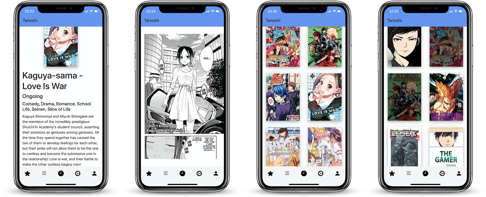
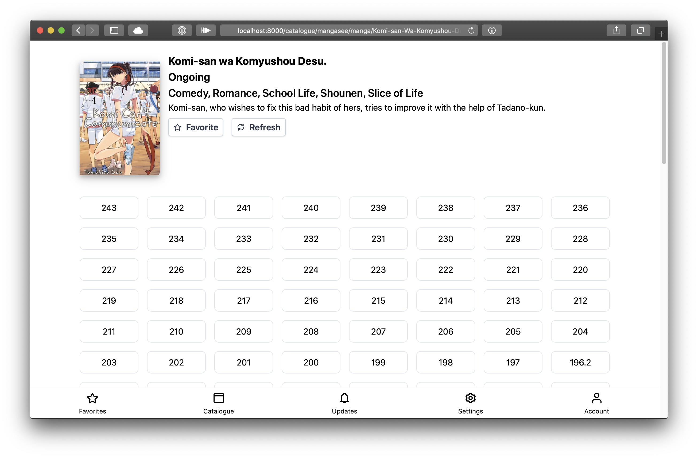
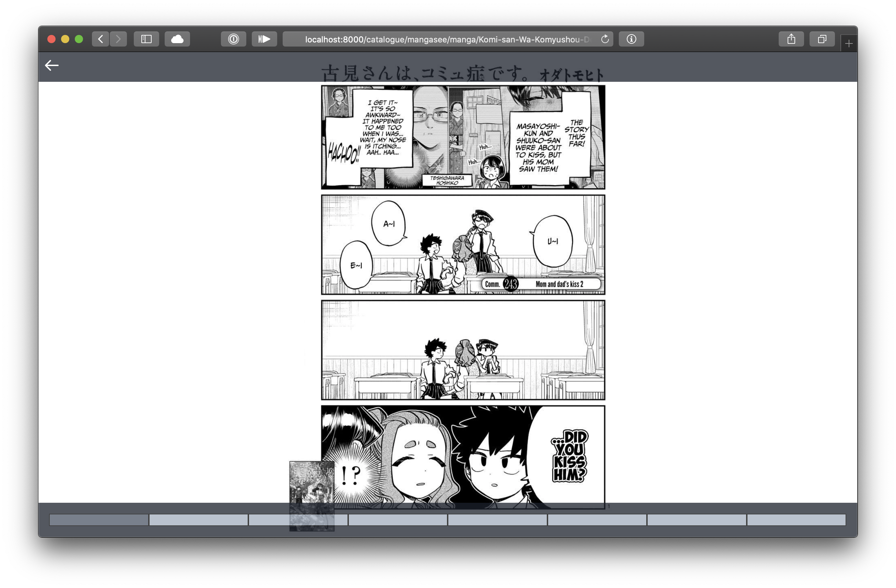

#  Tanoshi
Tachiyomi-like web manga reader. Front-end for [tanoshi](https://github.com/fadhlika/tanoshi)

## Goals
After switching to iOS from android, I really missing tachiyomi for reading manga.
Because I don't want to pay for annual fee of app store, 
I decided to make this a PWA with scraping on backend.

## Features
### Currently working
- Browse and read manga from mangasee
- Favorite mangas for faster reading
- Reading History across devices
- See chapter updates
### Planned
I'm trying to make this as close as tachiyomi, and add sync across device as well.

## Why Rust
Because I want to learn rust, and also webassembly

## Installation
Use Dockerfile below to install
```
FROM rust:1.41.1

ENV TOKEN_SECRET_KEY secret_key
ENV DB_PATH /tanoshi/db
ENV STATIC_FILES_PATH /tanoshi/dist

RUN apt update && apt install -y git curl
RUN curl -sS https://dl.yarnpkg.com/debian/pubkey.gpg | apt-key add -
RUN echo "deb https://dl.yarnpkg.com/debian/ stable main" | tee /etc/apt/sources.list.d/yarn.list
RUN apt-get update && apt install -y yarn

WORKDIR /usr/src
RUN git clone https://github.com/fadhlika/tanoshi-web /usr/src/tanoshi-web
RUN git clone https://github.com/fadhlika/tanoshi /usr/src/tanoshi
RUN mkdir -p /tanoshi


WORKDIR /usr/src/tanoshi-web
RUN yarn install
RUN yarn build
RUN mkdir -p /tanoshi/dist && cp -R /usr/src/tanoshi-web/dist /tanoshi/
RUN ls -l /tanoshi

WORKDIR /usr/src/tanoshi
RUN cargo build --release
RUN ls -l target/release
RUN cp /usr/src/tanoshi/target/release/tanoshi /usr/local/bin/tanoshi

EXPOSE 3030
CMD ["tanoshi"]
```

## Screenshots
## Mobile Screenshots


### Desktop




