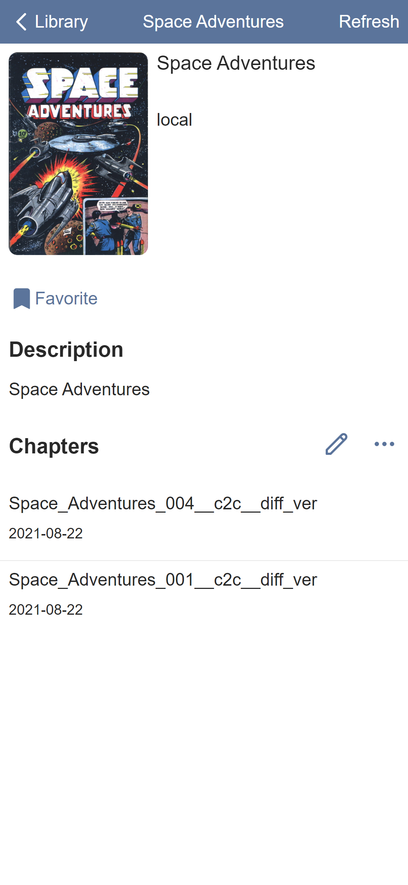
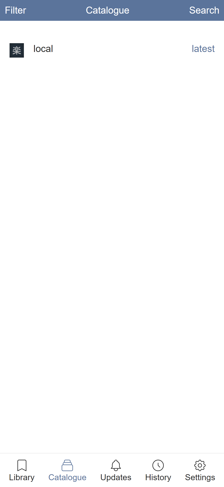
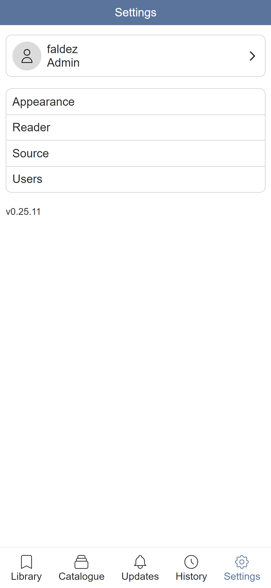

#  Tanoshi
Selfhosted web manga reader with extensions.

[](https://discord.gg/wPSEftdDqB)

## Screenshots
|  |          |      |
| ------------------------------------------- | ----------------------------------------------- | --------------------------------------------- |
|  |  |  |

## Features
### Currently working
- Browse, search, and read manga from local
- Catalogue sources are [extensible](https://github.com/fadhlika/tanoshi-extensions) using Webassembly
- Bookmark mangas
- Reading history across devices
- See chapter updates
- Read in single page, double page, or long strip
- Read from right to left or left to right
- Web reader is PWA and optimized for standalone mode on mobile
- Multi-user with admin and non admin role
- Periodic chapter updates
- Notification via Telegram and Pushover

### In development
- Filter feature

## Installation
### Prebuilt Binary
Download and run binary from latest release, aside from plugins all dependencies are statically linked. Prebuilt binary available for `amd64` platform.

### Docker
Docker image available for `amd64` and `arm64`. If you want to selfhost on a raspberry pi, you need 64 bit OS, such as ubuntu or Raspbian OS 64 bit. Tanoshi can't run on `arm` because [wasmer](https://github.com/wasmerio/wasmer) can't run on those platform yet, when `wasmer` could run on `arm` I will build image for `arm`.

If you want to use unreleased features, you can use tag `master`. It has everything from `master` branch.

```
docker create \
    --name=tanoshi \
    -p 8080:80 \
    --mount type=bind,source=/path/to/data,target=/tanoshi \
    --restart unless-stopped \
    faldez/tanoshi
```

```
docker start tanoshi
```

### Docker-compose

Refer to docker-compose.yaml.

### Extensions
By default tanoshi only support to read locally available manga specified in `local_path` in `config.yml`. To browse and read manga from external source, tanoshi needs extensions. Extensions can be donwnloaded from [here](https://github.com/fadhlika/tanoshi-extensions) in `repo` branch. 

You can download individual plugins and store in on your selected `plugins_path` in `config.yml`, or clone `repo` branch and copy all of plugins to `plugins_path`, or you can install from web.

### Account
On first run, tanoshi will ask you create account, then you can use the account to login. First user will always be admin, and can create new user.

## Usage
### CLI
```
tanoshi 

USAGE:
    tanoshi [FLAGS] [OPTIONS]

FLAGS:
    -h, --help            Prints help information
    -V, --version         Prints version information

OPTIONS:
        --config <config>    Path to config file
```

### Config
Tanoshi will look `config.yml` in `$TANOSHI_HOME` which defaults to `$HOME/.tanoshi` on macos and linux, `C:\Users\<username>\.tanoshi` on windows. Below is example configuration
```
# Port for tanoshi to server, default to 80
port: 3030
# Absolute path to database
database_path: /absolute/path/to/database
# JWT secret, any random value, changing this will render any active token invalid
secret: secret
# Absolute path to where plugin is stored
plugin_path: /absolute/path/to/plugins
# Absolute path to manga
local_path: /absolute/path/to/manga
# Periodic update interval, must be over 3600
update_interval: 3600
# Telegram token
telegram:
  name: <your bot name>
  token: <your bot token>
# Pushover
pushover:
  application_key: <your pushover application key>
```

local manga have to be structured below, it tested for `cbz` and `cbr` files
```
/path/to/manga
├─── Series 1
│    ├─── Volume 1.cbz
|    ├─── Volume 2.cbz
|    └─── ...
├─── Series 2
|    ├─── Volume 1.cbr
|    ├─── Volume 2.cbr
|    └─── ...
├─── Series 3
|    ├─── Volume 1.cbr
|    ├─── Volume 2.cbz
|    ├─── Volume 3
|    |    ├─── Page 1.png
|    |    ├─── Page 2.png
|    |    └─── Page 3.png
|    └─── ...
├─── Series 4.cbz
└─── Series 5.cbr
```

## Feedback/Questions/Discussion
Feel free to create issue or ask in [Discord Server](https://discord.gg/wPSEftdDqB)


## Build
Tanoshi backend use [rust-embed](https://github.com/pyros2097/rust-embed) to embed static files to the binary. Because of this, `tanoshi-web` need to be built first so `tanoshi` will be able to build successfully.

### Frontend
1. Install Rust
2. Install trunk and wasm-bindgen-cli
   ```
   cargo install trunk wasm-bindgen-cli
   ```
3. Change directory into `tanoshi-web`
    ```
    cd crates/tanoshi-web 
    ```
3. Build
    ```
    trunk build
    ```

### Backend
1. Change directory into `crates/tanoshi` or root repository
2. Install dependencies for https://github.com/faldez/libarchive-rs
3. Install dependency for https://gitlab.com/taricorp/llvm-sys.rs
   - on Windows, you can download from https://github.com/faldez/tanoshi-builder/releases/download/v0.1.0/LLVM.7z extract to a directory and set environment variable `$LLVM_SYS_110_PREFIX` to `/path/to/llvm` or build it yourself
   - on macOS, install using homebrew `brew install llvm@11` ands set `LLVM_SYS_110_PREFIX` to `/usr/local/opt/llvm`
   - on Linux
        ```bash
        wget https://apt.llvm.org/llvm.sh 
        chmod +x llvm.sh
        ./llvm.sh 11
        ```
4. Build
    ```
    cargo build
    ```

PS. On linux you may need to install libssl-dev on ubuntu/debian or openssl-dev on fedora/centos
